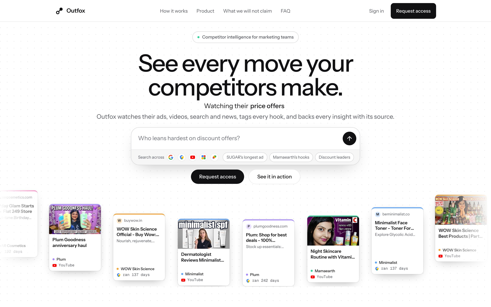
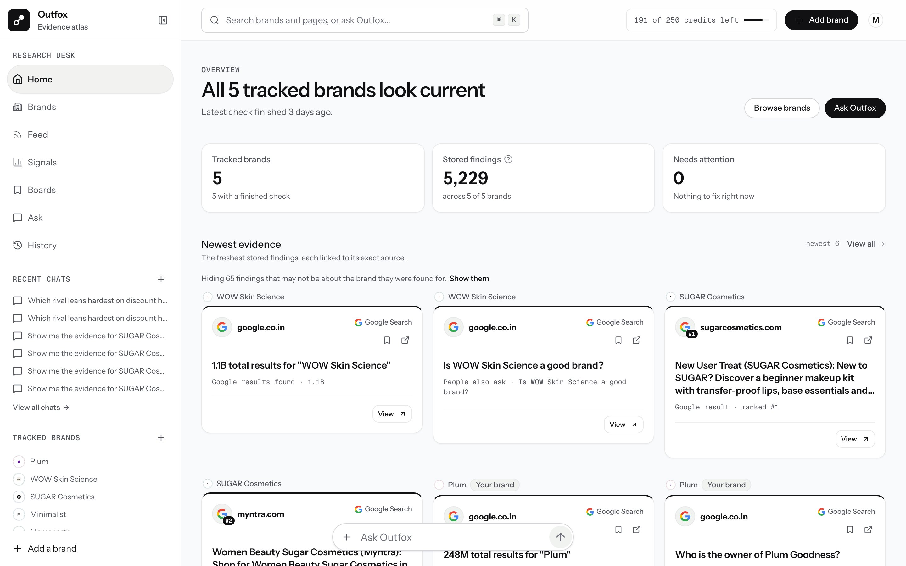
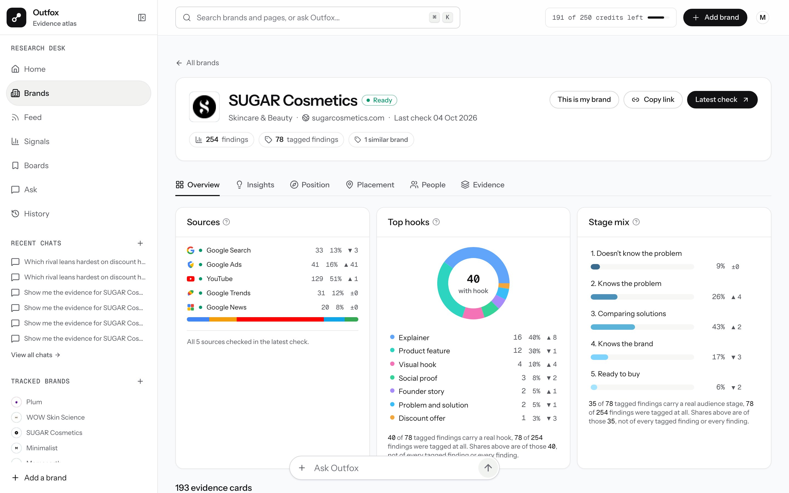
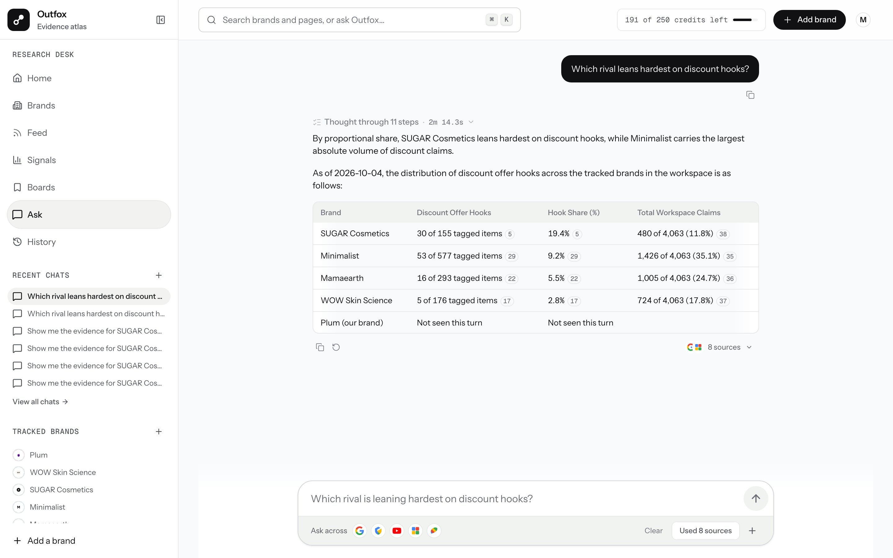
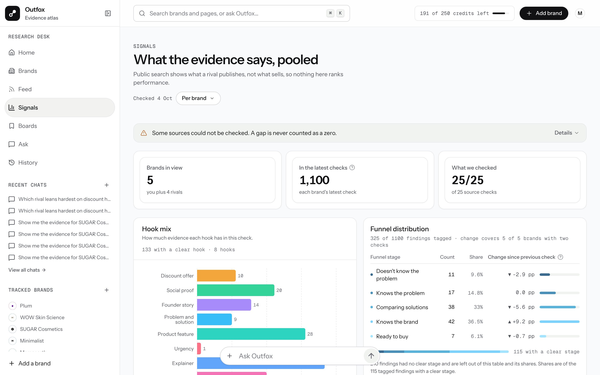
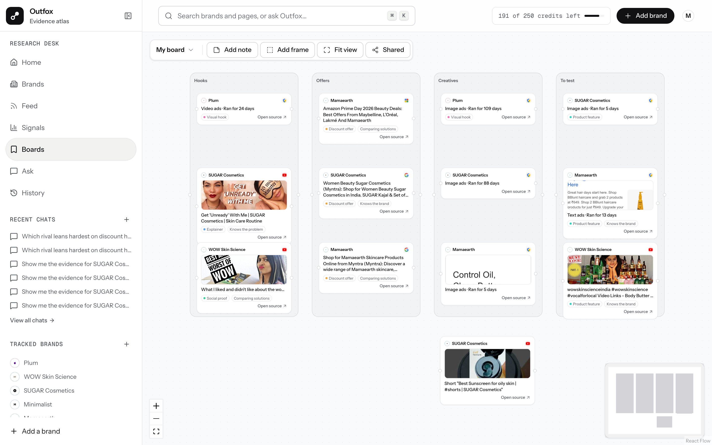
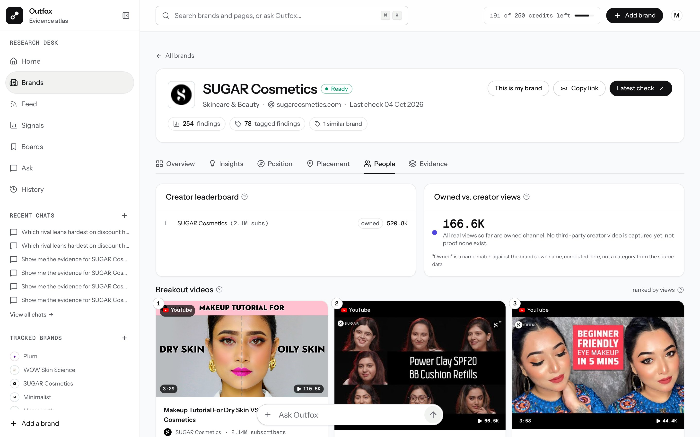

<h1 align="center">Outfox</h1>

<p align="center"><b>See every move your competitors make.</b></p>

<p align="center">
  <a href="https://outfox.mohitx.in">Live app</a> ·
  <a href="#how-outfox-uses-serpapi">How it uses SerpApi</a> ·
  <a href="#screens">Screens</a>
</p>

<p align="center">
  
  
  
  
</p>

<p align="center"></p>

## Hackathon entry

| | |
|---|---|
| **Event** | SerpApi India Hackathon 2026 |
| **Track** | **Commerce & Market Intelligence** |
| **Project** | Outfox, a competitor-research tool for marketing teams |
| **Live app** | https://outfox.mohitx.in |
| **Demo video** | https://www.youtube.com/watch?v=c2PLEA2LWcA |
| **Data source** | SerpApi, five engines, no scraping |

Outfox turns what rivals publish in public (ads, videos, search rankings, news, search interest) into structured, sourced evidence a marketing team can search, compare and ask questions about. Every number in the product links back to the public page it came from.

## The problem

A marketing team that wants to know what its rivals are doing does the same thing every week: search each rival, skim their YouTube channel, scroll the Ads Transparency Center, screenshot the best finds and paste them into a deck. The work is manual, it is never finished, and nobody can later say where a number came from.

## What Outfox does

Outfox runs that research for you, as a repeatable check, and keeps the evidence.

1. **Add a brand** by name or domain. Outfox finds its advertiser id and builds a search plan.
2. **Run a check.** Outfox calls five SerpApi engines for the brand and its rivals.
3. **Keep every result as a finding**, with the engine, the query, the page URL and the time it was fetched.
4. **Tag each finding** with the hook it uses (discount offer, social proof, founder story, explainer, and more) and the audience stage it targets, from "doesn't know the problem" to "ready to buy".
5. **Read it your way:** a Feed, a profile for each brand, Signals across all rivals, boards to share, and Ask for plain-language questions.

The first market is Indian D2C beauty: Plum, Minimalist, SUGAR Cosmetics, WOW Skin Science and Mamaearth. The model works for any category.

## How Outfox uses SerpApi

SerpApi is the only data source. Outfox does not scrape a single page itself: every ad, video, ranking and headline in the product is a SerpApi result, stored with the engine, the query, the page URL and the time it was fetched.

### Five engines, one picture of a rival

| SerpApi engine | How Outfox calls it | What the product builds from it |
|---|---|---|
| `google` | `gl=in`, `hl=en`, `google_domain=google.co.in`. The query is the brand name plus its vertical. | Search rankings, "People also ask", and shopping listings matched to the brand. |
| `google_ads_transparency_center` | Called per advertiser id, `region=2356` (India). The id is first resolved from the brand's own domain with an Ads Transparency lookup. | Every ad a brand runs: format, first and last date shown, and **how many days it has been live**. One SUGAR ad has run for 1,605 days. |
| `youtube` | `search_query` for the brand, then one `youtube_video` call per top video id. | A Feed of videos, a "Breakout videos" row ranked by views, and a creator leaderboard. |
| `google_trends` | Brands are compared in chunks, so one request covers several rivals. | A search-interest timeline per brand and region. |
| `google_news` | The same disambiguated query as search. | News coverage and what changed since the last check. |

### The creative parts

- **Ad longevity as a signal.** The Google Ads Transparency Center returns when an ad was first and last shown. Outfox turns that into "how many days has this rival kept this ad on", because an ad nobody switches off is an ad that works. Finding the advertiser id is itself a SerpApi call (`resolveAdsTransparencyAdvertiser`, matched against the brand's own domain), so tracking a brand needs no manual lookup.
- **Queries that find the brand, not the dictionary word.** A brand called "Minimalist" or "Plum" returns generic results. Outfox appends the brand's vertical to the query (`Minimalist Skincare & Beauty`), ignores placeholder verticals, and uses an owner-chosen search term verbatim when there is one.
- **Two-step YouTube.** The `youtube` engine finds videos; one `youtube_video` call per top result adds the details a search does not return, such as views and length. That is what powers the breakout-video ranking.
- **Credits as a first-class number.** SerpApi's free `/account` endpoint costs no credits, so Outfox reads it to show "searches left this month" in the top bar. Before a live search it checks the account again and refuses to spend below a reserve floor of 5, so a burst of requests cannot drain the plan.
- **Live search inside the chat.** Ask answers from stored findings. When that is not enough, the agent can fire one live Google search through SerpApi, capped at two per question. The results are saved as findings first, so the answer can cite them like any other source.
- **A budget on every fan-out.** A check plans its SerpApi calls up front and fails fast if they exceed the budget (30 per run), then runs them with bounded concurrency.
- **Honest failures.** `serpapiFetch` never throws. It returns `{ ok, data, latencyMs, credits }`, reads the credits SerpApi reports per call (`search_metadata.total_credits_used`), and redacts the API key from any error text. If an engine fails, that source is marked as a gap in the run and the interface says so. A gap is never counted as zero.

### Where it lives in the code

```
convex/lib/serpapiClient.ts      the single SerpApi entry point: key, latency, credits, redaction
convex/lib/serpApiAccount.ts     the free /account endpoint: plan, searches left, rate limit
convex/pipeline/fetchEngines.ts  param builders and fetchers for all five engines, budget, bounded concurrency
convex/pipeline/fetchBrand.ts    one brand, all engines, one run
convex/pipeline/refreshTrends.ts Google Trends refresh
convex/pipeline/webSearch.ts     the live search the Ask agent can call
```

The exact parameters sent to SerpApi for an ads lookup and a brand search:

```ts
export function buildAdsTransparencyParams(advertiserId: string) {
  return {
    engine: "google_ads_transparency_center",
    advertiser_id: advertiserId,
    region: "2356",
  };
}

export function buildGoogleSearchParams(brand: { name: string; vertical?: string; searchTerm?: string }) {
  const query = searchQueryForBrand(brand);
  return {
    engine: "google",
    q: truncateQuery(query),
    gl: "in",
    hl: "en",
    google_domain: "google.co.in",
  };
}
```

## From search result to insight

```
 Add brand ──► plan ──► fetch ──────────────► findings ──► tags ──► surfaces
                        SerpApi:                 engine       hook      Home, Feed,
                        google                   query        stage     Brand pages,
                        google_ads_transparency  page URL               Signals,
                        youtube + youtube_video  fetched at             Boards, Ask
                        google_trends
                        google_news
```

- **One check is one run.** A run records its plan, the status of every source, how many requests it made and what they cost.
- **A finding is the unit of evidence.** Text, metric and value where there is one, the SerpApi engine, the query, the page URL and the fetch time. Nothing is stored without a link back to its page.
- **Searches are budgeted.** The top bar shows how many are left this month, and a brand is only refreshed when you ask for it.
- **Gaps are never zeros.** If an engine fails or a page cannot be read, the run records a gap and the interface says so.

Ad spend, reach, follower counts and conversions are not in public data, so Outfox shows them as unavailable rather than estimating them.

## What you can do

| | |
|---|---|
| **Home** | See what changed across your tracked brands since the last check, and the newest findings. |
| **Feed** | Read the newest findings from every brand in one stream. Filter by source, hook, audience stage and date; the filters search everything stored, not just the latest few hundred. |
| **Brand pages** | Overview (sources, top hooks, stage mix), Insights (what the brand says about itself), Position (which hooks it leans on), Placement (search ranks and the ads it runs), People (creators and breakout videos) and Evidence (every finding, as cards or a table). |
| **Signals** | Compare which hooks and stages every rival leans on, pooled across brands, with the sources that could not be checked shown as gaps. |
| **Ask** | Ask a question in plain words, such as "Compare SUGAR, Minimalist and Mamaearth on discount hooks". Watch the steps, then read an answer where every number links to its source, and open the exact pages it rests on. |
| **Boards** | Save findings to a canvas, arrange them in columns, add notes and frames, and share a read-only link. |

## Screens

<p align="center"></p>
<p align="center"></p>
<p align="center"></p>
<p align="center"></p>
<p align="center"></p>
<p align="center"></p>

## Principles

- **Every claim has a source.** Each finding and each sentence in an answer links to the public page behind it.
- **Gaps are never zeros.** When a source could not be checked, the interface says so.
- **Only what is public.** Outfox never invents numbers that public data does not contain.
- **Spend searches on purpose.** Credits are visible, budgeted and protected by a reserve floor.

## Built with

| | |
|---|---|
| **Data** | SerpApi: Google Search, Google Ads Transparency Center, YouTube, Google Trends, Google News |
| **Frontend** | Next.js (App Router), React, TypeScript, Tailwind CSS, Radix UI, Motion, React Flow (boards), Recharts (charts) |
| **Backend** | Convex: database, server functions, scheduled jobs and authentication |
| **AI** | Vercel AI SDK with Google Gemini models, used to tag findings and to power Ask |
| **Hosting** | Vercel |

## Project structure

```
app/              routes: landing, sign-in, and the app screens
  api/chat/       streaming chat endpoint behind Ask
components/
  landing/        marketing page
  drishti/        app surfaces: feed, brands, signals, boards, ask
  ui/             base components
  orbs/           shader orbs used by the chat
convex/           backend: schema, queries, mutations, scheduled jobs
  pipeline/       checks: fetching from SerpApi and storing findings
  lib/            shared helpers, including the SerpApi client
public/           images
assets/           screenshots used in this README
```

## Author

Built by [Mohit Goyal](https://github.com/MohitGoyal09).
